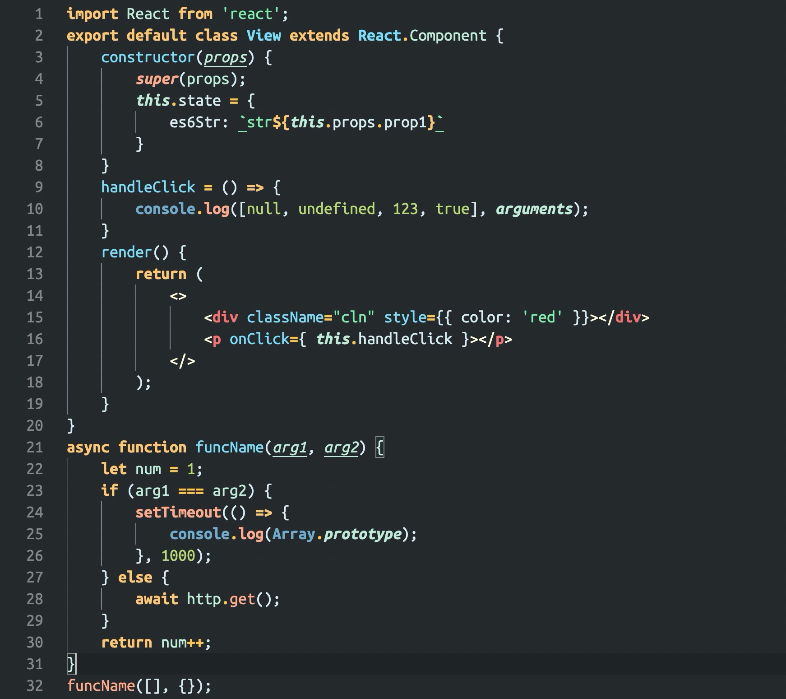

# ZS Theme

A pretty vscode theme for JSer/TSer. Hope you will like!



## When you see

-  <span style="display: inline-block; width: 30px; height: 12px; background: #FFC773"></span> Declarations and keywords
-  <span style="display: inline-block; width: 30px; height: 12px; background: #FFC64B"></span> Expressions and operators
-  <span style="display: inline-block; width: 30px; height: 12px; background: #7DDCF5"></span> Function name
-  <span style="display: inline-block; width: 30px; height: 12px; background: #FEAB8D"></span> Function or class call
-  <span style="display: inline-block; width: 30px; height: 12px; background: #C0EBD7"></span> Variables
-  <span style="display: inline-block; width: 30px; height: 12px; background: #D6ECF0"></span> Props
-  <span style="display: inline-block; width: 30px; height: 12px; background: #7FECAD"></span> String
-  <span style="display: inline-block; width: 30px; height: 12px; background: #B8D977"></span> Null or undefined or number or boolean
-  <span style="display: inline-block; width: 30px; height: 12px; background: #F47171"></span> HTML or JSX tags
-  <span style="display: inline-block; width: 30px; height: 12px; background: #FFFBDE"></span> HTML or JSX Angle brackets

## Getting started

### Installation

Launch Quick Open:

- Mac: `⌘ + P`
- Windows: `Ctrl + P`
- Linux: `Ctrl + P`

Paste the following command and press Enter:

```bash
ext install ZS Theme
```

And pick the one by **zhang-sai** as author.

## Activate theme

Launch Quick Open:

- Mac: `⌘ + Shift + P`
- Windows: `Ctrl + Shift + P`
- Linux: `Ctrl + Shift + P`

`Preferences: Color Theme` --> `ZS Theme`
