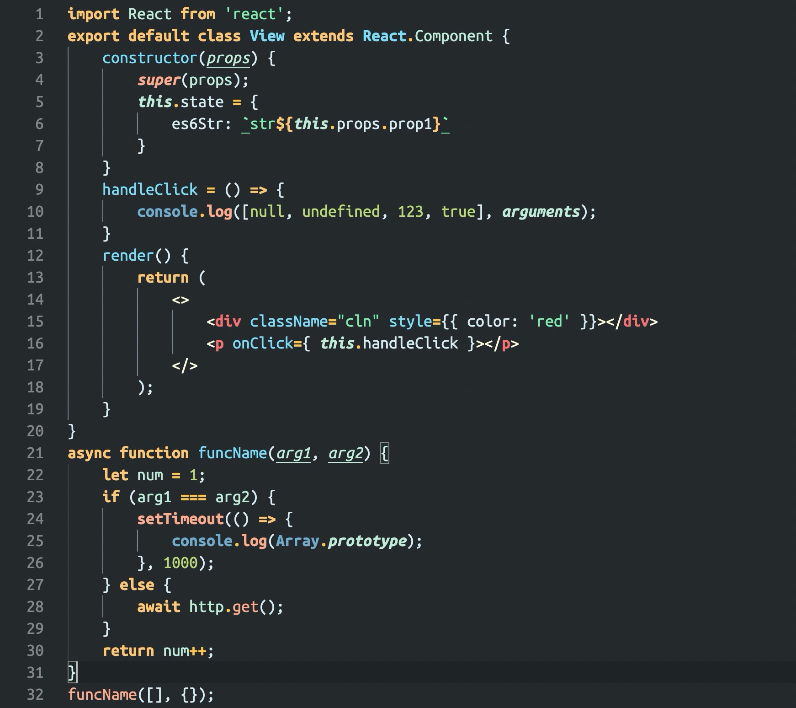
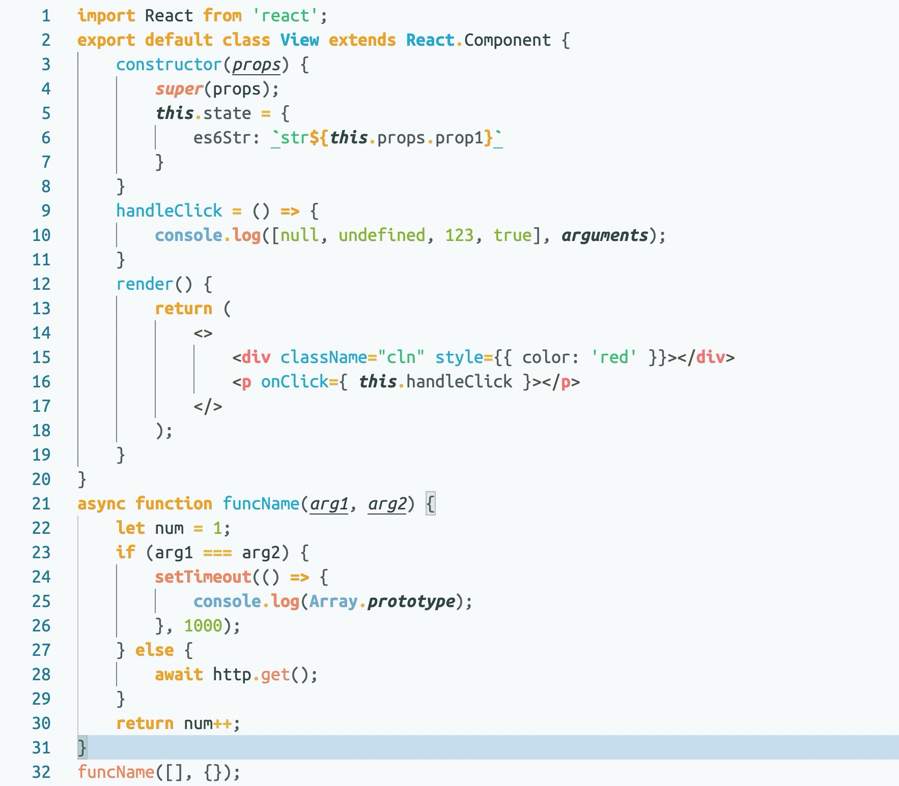

# ZS Theme

A pretty vscode theme for JSer/TSer. Hope you will like!

**Night theme:**


-  Declarations and keywords
-  Expressions and operators
-  Function name
-  Function or class call
-  Variables
-  Props
-  String
-  Null or undefined or number or boolean
-  HTML or JSX tags
-  HTML or JSX Angle brackets

**Light theme:**


-  Declarations and keywords
-  Expressions and operators
-  Function name
-  Function or class call
-  Variables
-  Props
-  String
-  Null or undefined or number or boolean
-  HTML or JSX tags
-  HTML or JSX Angle brackets

## Getting started

### Installation

Launch Quick Open:

- Mac: `⌘ + P`
- Windows: `Ctrl + P`
- Linux: `Ctrl + P`

Paste the following command and press Enter:

```bash
ext install ZS Theme
```

And pick the one by **zhang-sai** as author.

## Activate theme

Launch Quick Open:

- Mac: `⌘ + Shift + P`
- Windows: `Ctrl + Shift + P`
- Linux: `Ctrl + Shift + P`

Type `color theme`, choose `Preferences: Color Theme`, choose `ZS Night Theme` or `ZS Light Theme`.
